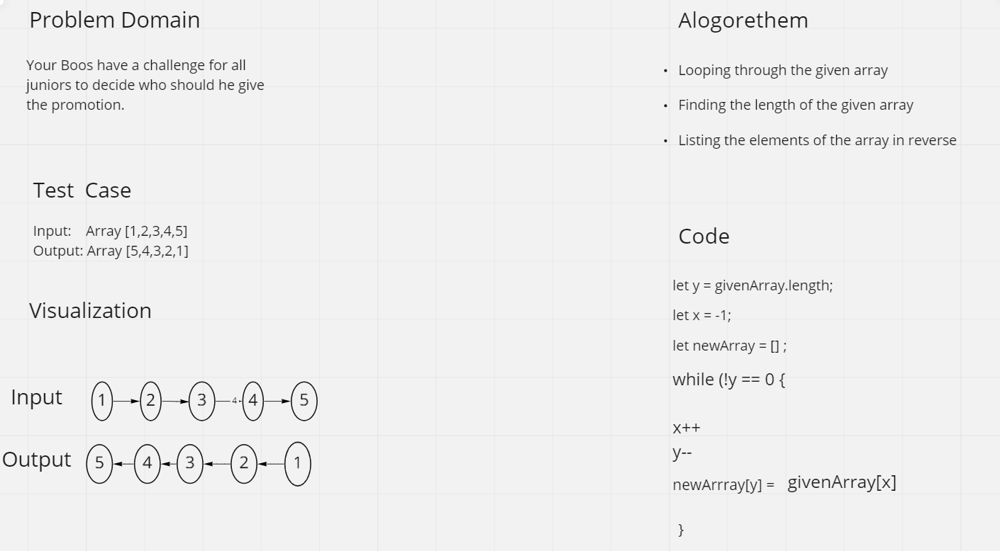

# Reverse an Array

* You have array of number you need to reversed without using any built-in functions.

# Whiteboard Process

# Approach & Efficiency
The goal is to execute the code in best possible time efficiency and in less code as possible.
