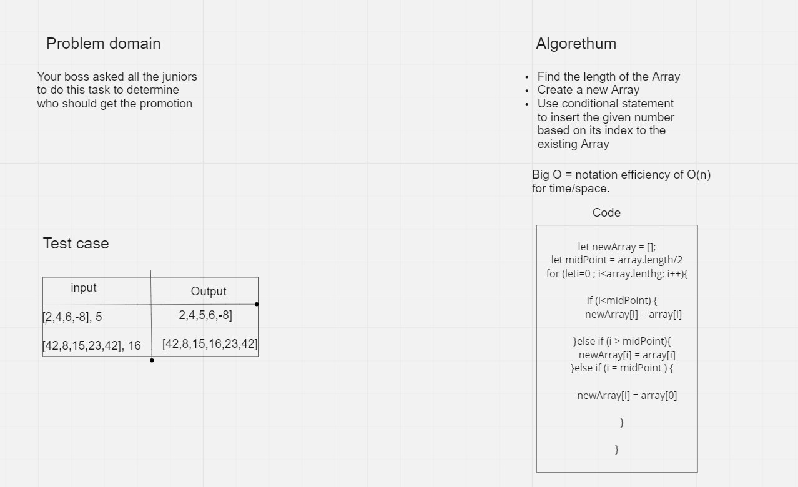

# insertShiftArray

* Writing a function  which takes in an array and a value to be added. Without utilizing any of the built-in methods , return an array with the new value added at the middle index.

# Whiteboard Process

# Approach & Efficiency
The goal is to execute the code in best possible time efficiency and in less code as possible.
