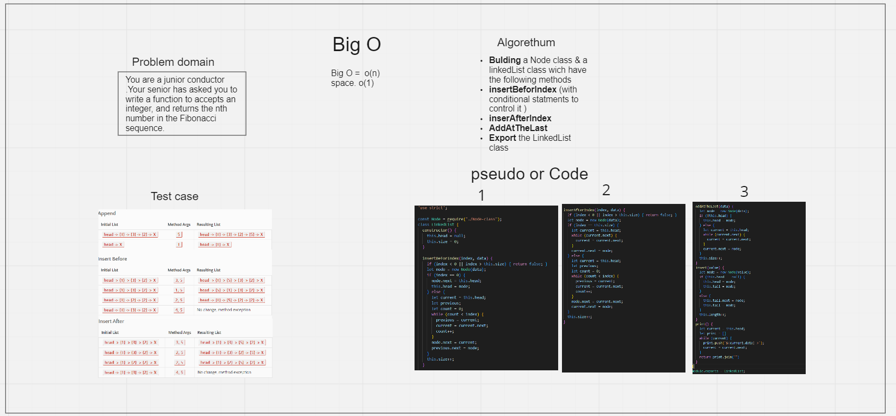
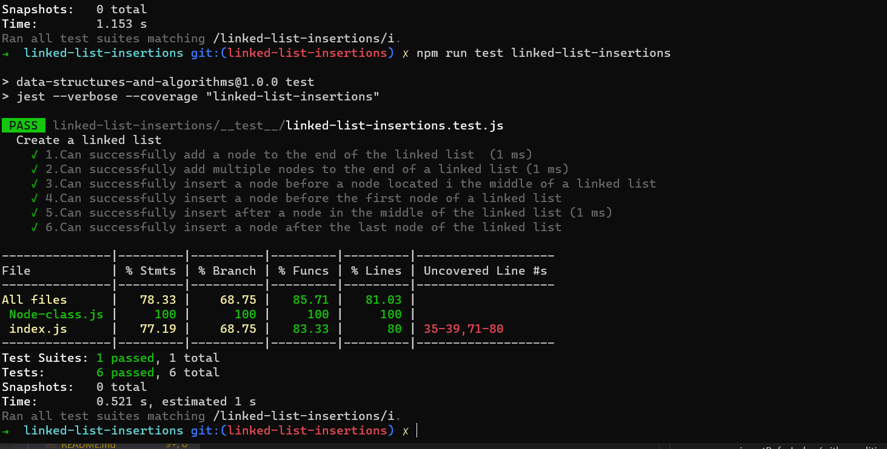

# Challenge Summary
Extending an Implementation whith the Follwing methods
* Append
* insertBefore
* insertAfter

# Whiteboard Process

# Approach & Efficiency
Bulding a Node class & a linkedList class wich have the following methods
* insertBeforIndex (with conditional statments to control it )
* inserAfterIndex
* AddAtTheLast

#### Big O
* Time =  o(n)
* Space = o(1)

# Test

# Submission details

## [Pull request ](https://github.com/h4mz411y/data-structures-and-algorithms/pull/27)

