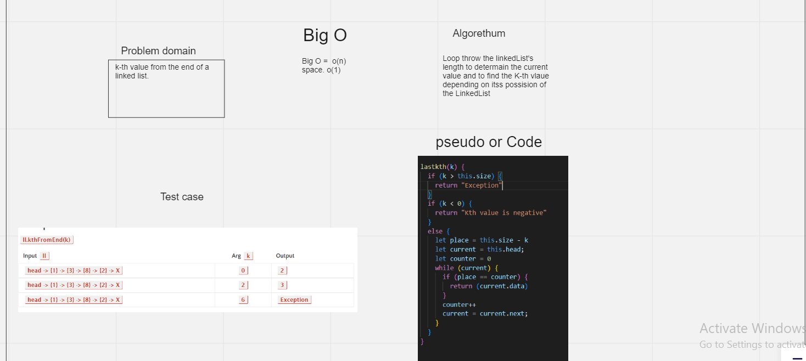
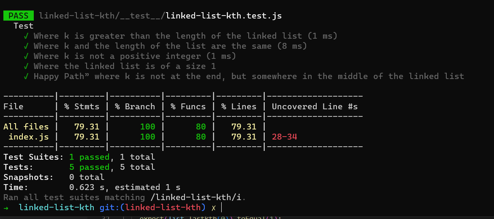

# Challenge Summary
Write the following method for the Linked List class:

* kth from end
* argument: a number, k, as a parameter.
Return the node’s value that is k places from the tail of the linked list.
* You have access to the Node class and all the properties on the Linked List class as well as the methods created in previous challenges.

# Whiteboard Process

#### Big O
* Time =  o(n)
* Space = o(1)

# Test

# Submission details

## [linked-list-kth/Github](https://github.com/h4mz411y/data-structures-and-algorithms/tree/main/javascript/linked-list-kth)

## [Pull request ](https://github.com/h4mz411y/data-structures-and-algorithms/pulls?q=is%3Apr+is%3Aclosed)

## [Actions link](https://github.com/h4mz411y/data-structures-and-algorithms/actions)
