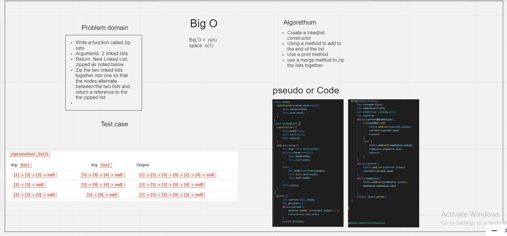
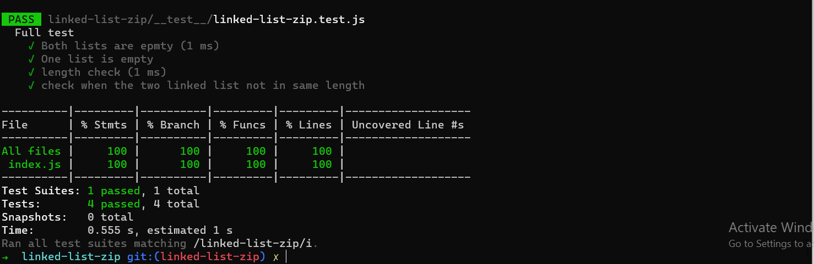

# Challenge Summary
* Write a function called zip lists
* Arguments: 2 linked lists
* Return: New Linked List, zipped as noted below
Zip the two linked lists together into one so that the nodes alternate between the two lists and return a reference to the the zipped list.
* Try and keep additional space down to O(1)

# Whiteboard Process

#### Big O
* Time =  o(n)
* Space = o(1)

# Test

# Submission details

## [linked-list-zip/Github](https://github.com/h4mz411y/data-structures-and-algorithms/tree/main/javascript/linked-list-zip)

## [Pull request ](https://github.com/h4mz411y/data-structures-and-algorithms/pulls?q=is%3Apr+is%3Aclosed)

## [Actions link](https://github.com/h4mz411y/data-structures-and-algorithms/actions)
