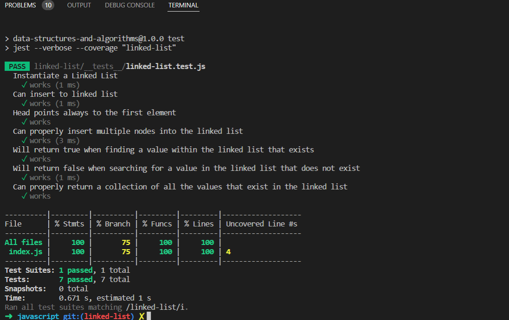

# Linked_list
* Linked List is a linear data structure. Unlike arrays, linked list elements are not stored at a contiguous location; the elements are linked using pointers.

* In simple words, a linked list consists of nodes where each node contains a data field and a reference(link) to the next node in the list.

# Challenge

* node : Create a Node class that has properties for the value stored in the Node, and a pointer to the next Node.

* Create a Linked List class
Within your Linked List class, include a head property.
Upon instantiation, an empty Linked List should be created.

# Approach & Efficiency

* LinkedList.prototype.insert *O*(1)
* LinkedList.prototype.includes *O*(N)
* LinkedList.prototype.toString *O*(N)

# Test

# API

