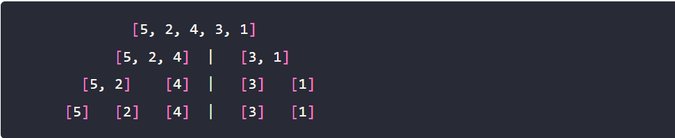
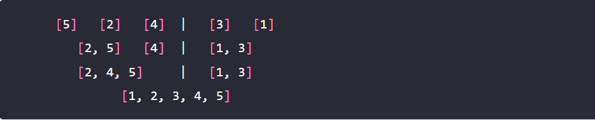

# Merge_sort

## Whiteboard process

## Trace

* Defining the middle index
* Sort each index into an indevisual array of index.

* Sort each half independently
* compined all the sorted indexes in on final array.

