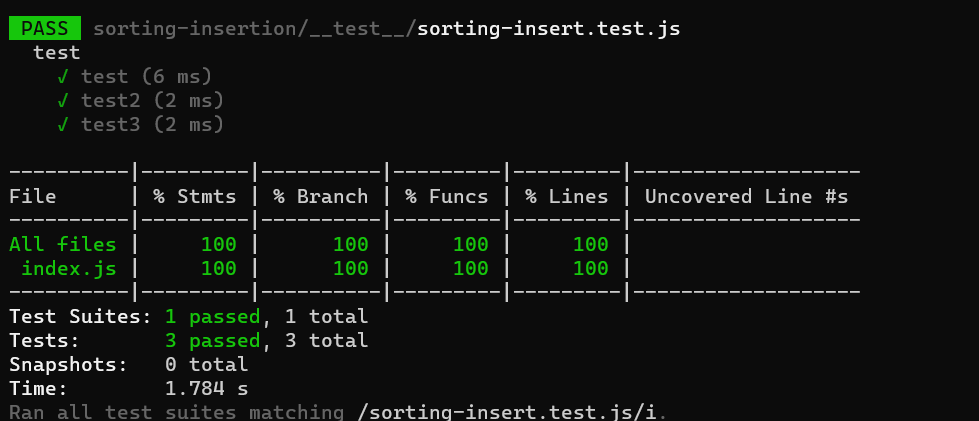

# sort

Trace

## Sample array [2,3,7,5,13,11]

 * phase1

In the first pass through of the selection sort, we evaluate if there is a smaller number in the array than what is currently present in index 0. We find this smaller number right away in index 1. The minimum value gets updated to remember this index. At the end of the evaluation, the smaller number will be swapped with the current value in index i. This results in our smallest number of our array being placed first.

 * phase 2

The index will keep moving to find the next mixed up values and switch them.

* phase 3

The final output will be the sorted array
